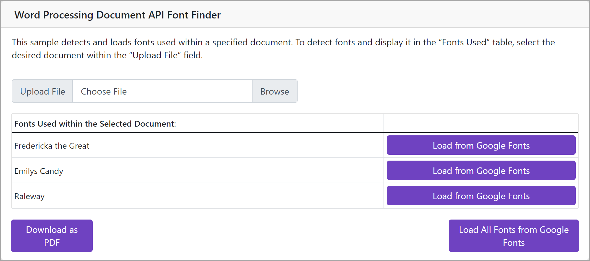

# Word Processing Document API – Detect and Download Fonts

The following example detects and loads custom fonts used within a document. The application obtains a list of all fonts used in the document and loads them from the [Google Fonts](https://fonts.google.com/) resource, when required. Loaded fonts are added to the [DXFontRepository](https://docs.devexpress.com/CoreLibraries/DevExpress.Drawing.DXFontRepository) automatically and made available without additional installation requirements.

>![**Note**]
> Google Fonts are open-source, but be sure to read the associated license agreement to determine usage rights for your particular use case.



## Implementation Details

The application uses the [DocumentIterator API](https://docs.devexpress.com/OfficeFileAPI/DevExpress.XtraRichEdit.API.Native.DocumentIterator) to detect fonts used in a document loaded to the [RichEditDocumentServer](https://docs.devexpress.com/OfficeFileAPI/DevExpress.XtraRichEdit.RichEditDocumentServer) instance. The application lists them in a table. You can click **Load From Google Fonts** button for an individual font or click **Load all Fonts from Google Fonts** to download all.

The fonts are loaded from Google Fonts and added to the [DXFontRepository](https://docs.devexpress.com/CoreLibraries/DevExpress.Drawing.DXFontRepository). When all fonts are added to the font collection, click the **Download as PDF** button to open the resulting document in PDF format.

## Files to Review

* [Index.razor](./CS/Pages/Index.razor)
* [Dockerfile](./CS/Dockerfile)

## Build a Docker Image

### Visual Studio  

You can run the app on supported Windows platforms, Windows Subsystem for Linux or Docker. Select a platform from the debug drop-down in the toolbar, and start debugging the app.  

### CLI  

Run the application from the dotnet CLI on Windows, Linux and MacOS with the dotnet run command. To run the Docker container from the command line, build the Docker image. You should pass the DevExpress NuGet source URL as a secret to restore NuGet packages. Use the following commands to build and run the docker image: 

```console
docker build -t officefontsapp. 

docker run -d -p 8080:80 officefontsapp 
```

The application page is available at the following URL: http://localhost:8080/.